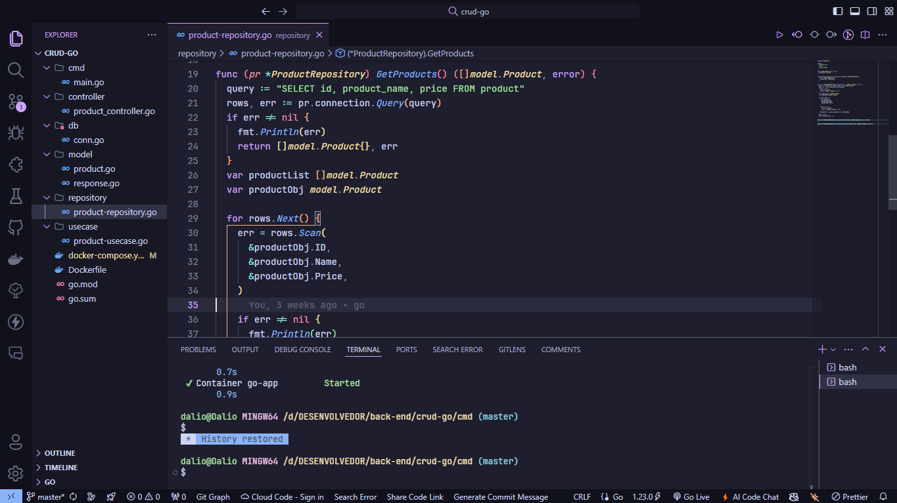

# Go

## Índice

- [Visão Geral](#visão-geral)
  - [Imagens](#Imagens)
- [Funcionalidades](#funcionalidades)
- [Tecnologias Utilizadas](#tecnologias-utilizadas)
- [Começando](#começando)
  - [Pré-requisitos](#pré-requisitos)
  - [Instalação](#instalação)
- [Contribuindo](#contribuindo)
- [Contato](#contato)

## Visão Geral

Desenvolvendo aplicações com Golang, utilizando Docker para facilitar a configuração do ambiente e integrando com o banco de dados PostgreSQL, garantindo alta performance e escalabilidade.

## Imagens

Aqui estão algumas imagens do projeto:

<div>
    
</div>

## Funcionalidades

- Criação de APIs RESTful
- Gerenciamento de Sessões
- Persistência de Dados
- Containers e Orquestração
- Integração com Serviços Externos
- Tarefas Assíncronas e Filas

## Tecnologias Utilizadas

- [Golang](https://go.dev/)
- [Docker](https://www.docker.com/)
- [PostgreSQL](https://www.postgresql.org/)

## Começando

### Pré-requisitos

- Docker
- PostgreSQL
- extensão Go

### Instalação

1. Clone o repositório:

   ```bash
   git clone https://github.com/DalioSY/go
   ```

## Contribuindo

Contribuições são bem-vindas! Por favor, siga estas etapas para contribuir:

1. Faça um fork do repositório.
2. Crie uma nova branch (`git checkout -b feature/SuaFuncionalidade`).
3. Faça suas alterações.
4. Faça um commit das suas alterações (`git commit -m 'Adicionei uma nova funcionalidade'`).
5. Envie para a branch (`git push origin feature/SuaFuncionalidade`).
6. Crie um novo Pull Request.

## Contato

- **Dalio Shindi Yamada**
- [GitHub](https://github.com/DalioSY)
- [LinkedIn](https://www.linkedin.com/in/dalio-s-yamada)
- [Portfólio](https://daliosy.github.io/my-PORTFOLIO)
